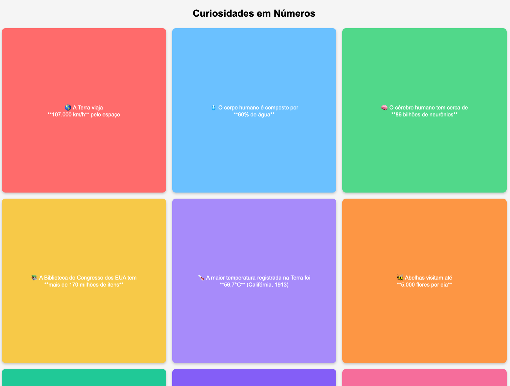

# pythonFlask

## install python 3
    brew install python 
for other OS check the official  instalation guide

## install flask
Guide: [Flask Guide](https://flask.palletsprojects.com/en/stable/installation/)

##### Create a project folder and a .venv folder within: 
    python3 -m venv .venv

##### Before you work on your project, activate the corresponding environment:
    . .venv/bin/activate
##### Install Flask
    pip install flask

## docker
    docker build -t python-flask . 
    docker image tag luisneu/python-flask luisneu/python-flask:latest
    docker run -p 8081:5000 python-flask

